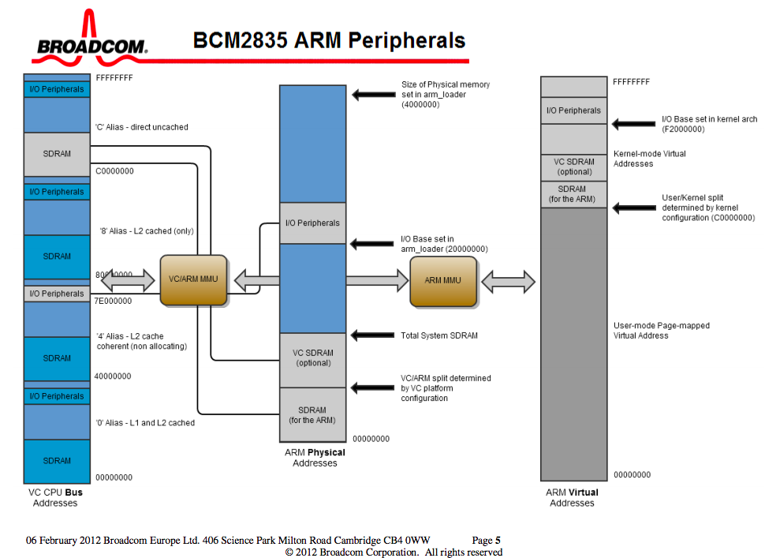
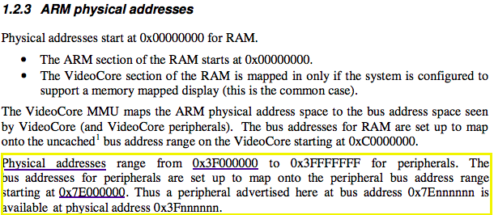

# Assignment I
###LED GPIO Kernel Module *(CMPE242, Spring 2018)*
-

###Introduction

The main goal of this task is to write a kenel module that will light up an LED through the GPIO pins of the development board. For this project, I am using a **Raspberry Pi Ver. 3**. I have chosen to do a simple implementation where the LED lights up when the kernel module is insterted (insmod), and turns off when the module is removed (rmmod).

This document is intended for those that want a simple and straight forward introduction to this sort of task. We will cover how to:  

* Understanding the steps needed to accomplish the task.
* Understanding the memory layout of the device.
* Understanding how to set the necessary registers of the device.
* **Brief** overview of what memory mapping is, and why its needed.

Other topics such as how to compile the module or how to download kernel sources will not be covered in this document.

### Memory Maps
Typically, one interacts with an I/O device through the use of special purpose registers. For example, one can read registers to know about a device status, or write to registers -- asking the device to perform a particular action. Most microprocessors today offer a way to communicate with these device registers through **memory mapped I/O**. This means that registers on the target device (the ones you need to read from and write to) are accessible to you as memory addresses. Thus, to write or read from a particular register on your target I/O device, all you have to do is write the value into a particular *memory address*. Any data sent to that memory address, is actually sent to the corresponding I/O device. The only hard part is looking throught the specification to figure out which register does what, and what the memory mapped address is.

For Example:

1. Let's consider a **non-real and simple example for illustration**. Let's say, John has a *speaker device* that makes a barking sound on command. The device has one register that is 32 bits wide. 

2. The *specification* for this barking machine says that one must write a single 1, and all other 0's in order for the device to bark. It does not matter where the 1 is placed, as long as there is only 1 bit enabled, and all other bits are 0's.

  `So writing --> 0x00000001 == 0x01000000 (both make the device bark!)`

3. Ok, so now we know what the devie does, and how we make it bark. Now let's assume that this devie is memory mapped onto your CPU. This means that the CPU has reserved a special memory address, just for that barking register. Let's say that register is located at address 0x40000003 (completely made up!).
4. All we need to do is figure out how to write to memory...if only we knew how to do that...we do! Use a C program to write to it. Assuming there is no virtual memory or anything like that, we would have to simply say:  

  `*((uint32_t *) 0x40000003) = 0x00000001;` 

   * `(uint32_t *) 0x40000003` means: get the number **0x40000003** (address to our memory mapped I/O), make it into a pointer to memory. 
   * `*((uint32_t *) 0x40000003)` means: Now assign the value at that pointer to be 0x00000001. (Dereferenced the pointer)

5. When that is executed, the value will be directed to your barking device, and your device will bark!

Good Explenation: [Lecture 5: Memory Mapped I/O](#https://www.youtube.com/watch?v=aT5XMOrid7Y)

### Raspberry Pi (RPi) V3 Memory Mapped Addresses

In order to learn more about how the memory mapping is done on the RPi, we need to look at Broadcom's spec sheet. It shows the following picture explaining the memory layout of the device:

One can quickly notice that there are three types of memory addresses. They are the **VC CPU Bus Addresses**, **ARM Physical Addresses**, and the **ARM Virtual Addresses**. This is important! Understanding which ones you are supposed to use in your program, and how they translate is essential to making your program work correctly (segmentation faults anyone?). Well, Broadcomm provides some assistance in understanding what the address range for our peripherals is.

Original Document: [Stanford Web](#https://web.stanford.edu/class/cs140e/docs/BCM2837-ARM-Peripherals.pdf)

Cool! So now we know that our device registers are located in **Physical Address** starting at 0x3F000000. Our GPIO pin will be found somewhere in that range. But we also found out that Broadcomm provides all of the documentation in terms of **Bus Addresses**. So, like they mention, any register that is denoted as address 0x7Ennnnnn (Bus Address) should be interpreted as 0x3Fnnnnnn (Physical Address). So we now know how to translate a peripheral **Bus Address** --> **Physical Address**.

One more thing. By now, you should know that CPUs use a Memory Management Unit and will use Virtual Addressing for the Operating System (if you don't, go read up on it, its cool...i'll wait for you). This means that any addresses we refer to in our code will be **Virtual Addresses**. So if we know what **Physical Address** we need to use, how do we know what the **Virtual Address** is for it? One uses the `ioremap()` system call in order to retrieve a virtual address for a given physical address. So by calling `ioremap()` with the known physical address for our device, we are good to go!

Good Explenation: [Mapping in C](#https://www.quora.com/How-are-mmap-ioremap-and-kmap-different)

Other good resources:

* [How to access I/O mapped memory from within device drivers](#http://www.infradead.org/~mchehab/kernel_docs/unsorted/bus-virt-phys-mapping.html)
